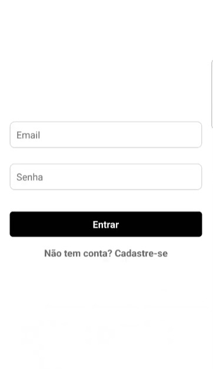
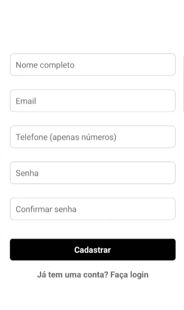
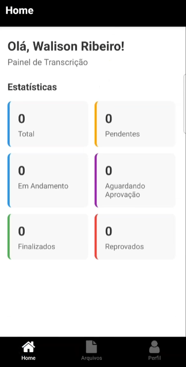
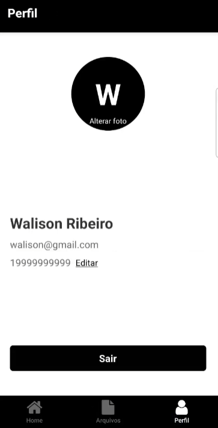
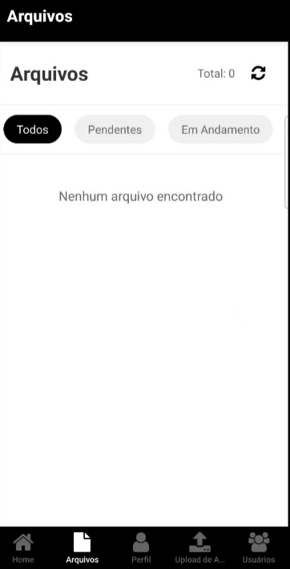
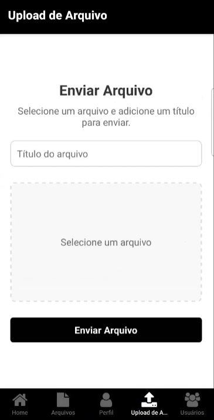
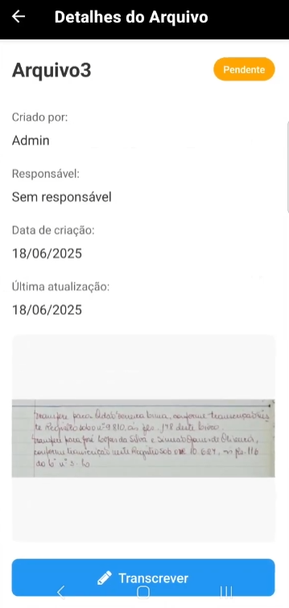
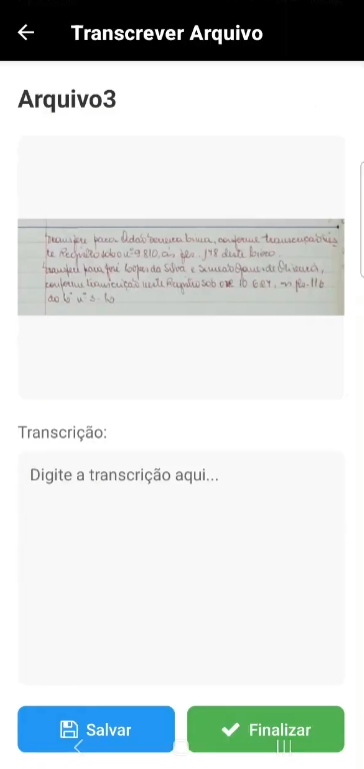
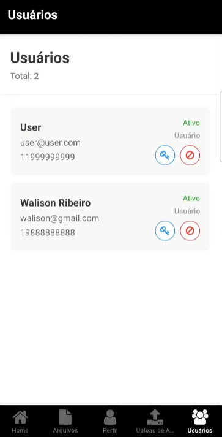

# Transcrever

O projeto consiste no desenvolvimento de uma plataforma digital para a transcrição e digitalização de dados provenientes de cartórios físicos, com o objetivo de modernizar o armazenamento, facilitar o acesso às informações e garantir maior segurança e organização dos registros.

## Equipe do projeto

Luiz Carlos Martinez Motta Neto

Walison Vinicios Alves Ribeiro

## Sumário

1. Requisitos
2. Configuração de acesso aos dados
3. Estrutura do projeto
4. Instale os requisitos do projeto
5. Executando o projeto
6. Telas do projeto

## 🔧 Requisitos:

### Requisitos do Sistema:
- **Node.js** LTS v18.0.0 ou superior
- **npm** ou **yarn** (gerenciador de pacotes)
- **Expo CLI** (para desenvolvimento)
- **Expo Go** (aplicativo para testar no dispositivo móvel)

### Tecnologias Principais:
- **Expo SDK** ~53.0.9
- **React** 19.0.0
- **React Native** 0.79.2
- **TypeScript** ~5.8.3
- **Expo Router** ~5.0.6 (navegação)
- **Expo SQLite** ~15.2.10 (banco de dados local)

### Dependências Principais:
- **@clerk/clerk-expo** ^2.11.8 (autenticação)
- **expo-image-picker** ~16.1.4 (seleção de imagens)
- **expo-file-system** ~18.1.10 (manipulação de arquivos)
- **expo-sharing** ~13.1.5 (compartilhamento)
- **@react-native-async-storage/async-storage** 2.1.2 (armazenamento local)

## 📦 Estrutura do Banco de Dados

### 👤 Tabela `users` com os seguintes campos:
```
id: INTEGER (chave primária, autoincremento)
name: VARCHAR(50) (obrigatório) - Nome do usuário
phone: VARCHAR(11) (obrigatório) - Telefone do usuário
profile_image: VARCHAR(255) (opcional) - Caminho da imagem de perfil
user_type: BOOLEAN (padrão 0) - Tipo de usuário (ex: 0 = comum, 1 = administrador)
email: VARCHAR(50) (obrigatório, único) - E-mail do usuário
password: VARCHAR(255) (obrigatório) - Senha do usuário (criptografada)
change_password: BOOLEAN (padrão 0) - Indica se o usuário precisa alterar a senha
active: BOOLEAN (padrão 1) - Indica se o usuário está ativo
```

### 📁 Tabela `files` com os seguintes campos:
```
id: INTEGER (chave primária, autoincremento)
title: VARCHAR(100) (obrigatório) - Título ou descrição do arquivo
file_path: VARCHAR(255) (obrigatório) - Caminho para o arquivo salvo
created_by: INTEGER (obrigatório) - ID do usuário que criou o arquivo
responsible_by: INTEGER (opcional) - ID do usuário responsável pelo arquivo
status: VARCHAR(50) (obrigatório) - Status do arquivo (ex: pendente, aprovado, etc.)
text: TEXT (opcional) - Texto transcrito do arquivo
created_at: DATETIME (padrão: data/hora atual) - Data de criação
updated_at: DATETIME (padrão: data/hora atual) - Última data de atualização
```

## 🔐 Configuração de acesso ao banco de dados
```
Nativo SQLite, não precisa ser configurado
```

## 📁 Estrutura do projeto:
```
nomeDoProjeto/
├── apresentacao
│   └── apresentacao.pptx
├── documentacao
│   ├── 01_cartaDeApresentacao.pdf
│   ├── 02_cartaDeAutorizacao.pdf
│   ├── 03_declaracaoDeUsoDeDadosPublicos.pdf
│   └── 04_roteiroDeExtensao.pdf
├── frontend
│   ├── assets
│   │   └── images
│   ├── contexts
│   ├── src
│   │   └── app
│   │       ├── (protected)
│   │       │   └──(tabs)
│   │       ├── components
│   │       │   ├── Button
│   │       │   └── Input
│   │       └── database
│   ├── .gitignore
│   ├── package.json
backend
│   └── database
├── video
│   └── video.txt
└── readme.md

```

## 📦 Instale os requisitos do projeto:

### Pré-requisitos:
```bash
# Instalar Node.js (versão LTS)
# Baixar em: https://nodejs.org/

# Instalar Expo CLI globalmente
npm install -g @expo/cli

# Instalar Expo Go no seu dispositivo móvel
# Android: Google Play Store
# iOS: App Store
```

### Instalação das dependências:
```bash
# Navegar para a pasta do projeto
cd frontend

# Instalar dependências
npm install
# ou
yarn install
```

## 🚀 Execute o projeto:

### Desenvolvimento:
```bash
# Iniciar o servidor de desenvolvimento
npm start
# ou
expo start

# Escanear o QR Code com o Expo Go
# ou pressionar 'a' para Android / 'i' para iOS
```

### Comandos úteis:
```bash
# Executar no Android
npm run android

# Executar no iOS
npm run ios

# Executar na web
npm run web

# Limpar cache
npm run reset-project
```

## 📱 Telas do projeto

### 🔐 **Autenticação**

**Tela 1: Login**
*Interface de autenticação com campos para email e senha*


**Tela 2: Registro**
*Formulário para criação de nova conta de usuário*


### 🏠 **Área Principal**

**Tela 3: Home/Dashboard**
*Dashboard principal com estatísticas dos documentos e resumo do sistema*


**Tela 4: Perfil do Usuário**
*Gerenciamento de dados pessoais e configurações da conta*


### 📁 **Gerenciamento de Arquivos**

**Tela 5: Lista de Arquivos**
*Visualização de todos os documentos disponíveis para transcrição*


**Tela 6: Upload de Arquivo**
*Interface para envio de novos documentos para transcrição*


**Tela 7: Detalhes do Arquivo**
*Visualização completa de um documento específico com opções de ação*


### ✍️ **Transcrição**

**Tela 8: Transcrever Arquivo**
*Interface para realização da transcrição de documentos*


### 👥 **Administração**

**Tela 9: Gestão de Usuários**
*Painel administrativo para gerenciamento de usuários do sistema*


### ⚙️ **Configurações**

**Tela 10: Alterar Senha**
*Formulário para modificação da senha do usuário*


### 📊 **Funcionalidades por Tipo de Usuário**

#### **Administrador:**
- Acesso completo a todas as funcionalidades
- Gerenciamento de usuários (Tela 9)
- Aprovação/rejeição de transcrições
- Visualização de estatísticas gerais (Tela 3)

#### **Transcricionista:**
- Upload de documentos (Tela 6)
- Seleção de documentos para transcrição (Tela 5)
- Realização de transcrições (Tela 8)
- Visualização de documentos próprios (Tela 7)
- Gerenciamento de perfil pessoal (Tela 4)

### 🎨 **Características da Interface**
- Design responsivo e intuitivo
- Navegação por abas na área principal
- Sistema de cores para status dos documentos
- Componentes reutilizáveis (Button, Input)
- Feedback visual para ações do usuário
